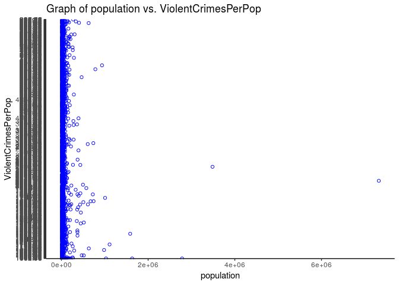
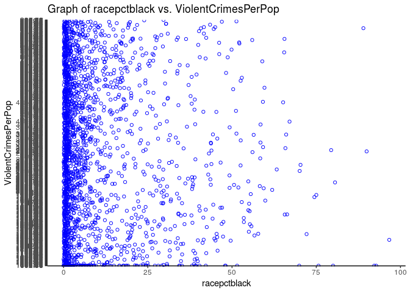
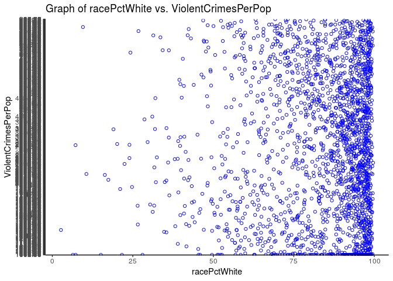
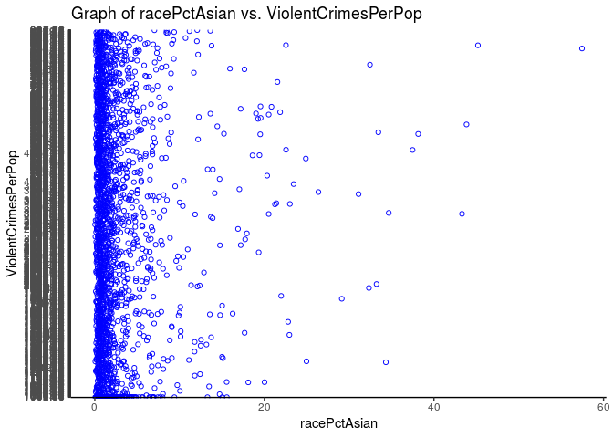
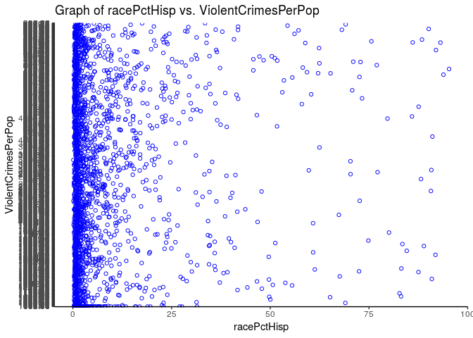
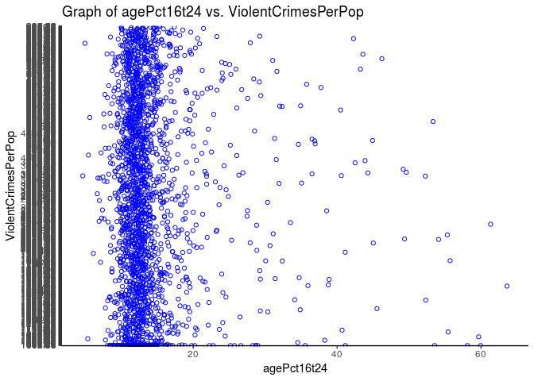
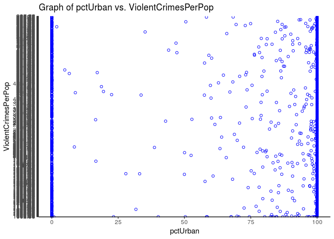
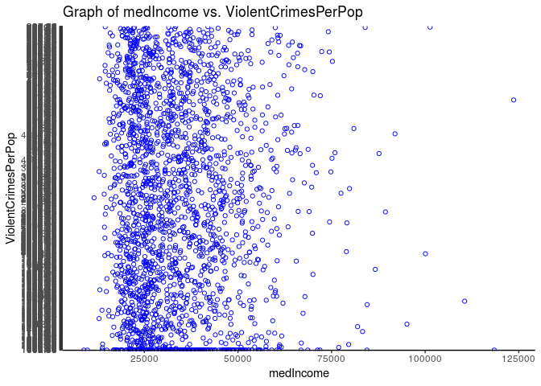

ANALYSIS OF FACTORS CONTRIBUTING TO CRIME
================
The Blue Devils
March 29, 2019

## Section 1. Introduction

While brainstorming problems we might want to explore, we began to think
about issues relevant to our community at Duke and how Durham, NC has
changed over time. It is a frequent occurrence to hear someone who has
lived for a long time in the area talk about how Durham, particularly
downtown Durham, has changed significantly over the past 10 to 20 years
in several ways, including in terms of a reduction of crime rates.
Considering this phenomenon caused us to wonder about why this might be
and what factors might contribute most to crime rates in general.

This thought process was our motivation for considering the question of
what factors related to attributes of a given location and population
would best predict crime rates. For this purpose, we obtained a data set
concerning communities and crime from the UCI Machine Learning
Repository site, which includes 147 variables and 2215 observations.

Given the factors included in this data set, we hypothesize that median
income, the percentage of people in the area who live in an urban
setting, and the population’s level of education will be among the
strongest predictors of crime. The rationale for this hypothesis is that
low median income, an urban setting, and a less educated population seem
to be factors that might predispose populations to higher rates of
crime.

## Section 2. Analysis plan

There are two response variables that we are interested in. One is the
variable ViolentCrimesPerPop, which is the total number of violent
crimes per 100K popuation. The other is the variable nonViolPerPop,
which is the total number of non-violent crimes per 100K popuation. The
values that both of these variables take are numeric decimals.

For predictor variables, there were originally 147 variables in the
entire dataset, but we scanned through and chose the ones that we
thought were the most interesting. We chose these variables not because
we thought that they were the ones that would have the highest
correlation, but because they were the variables that we were most
interested in. We know that in actual practice if we were trying to do
analysis on this data we would not want to arbitrarily select variables,
because we might be missing something important. However, for this class
and for our analysis we believe that instead of running backwards
selection for all 147 variables that it is reasonable to select 25 or so
that we are particularly interested in. These variables include:

  - population: population for community: (numeric integer)
  - racepctblack: percentage of population that is african american
    (numeric decimal)
  - racePctWhite: percentage of population that is caucasian (numeric
    decimal)
  - racePctAsian: percentage of population that is of asian heritage
    (numeric decimal)
  - racePctHisp: percentage of population that is of hispanic heritage
    (numeric decimal)
  - agePct16t24: percentage of population that is 16-24 in age (numeric
    decimal)
  - pctUrban: percentage of people living in areas classified as urban
    (numeric decimal)
  - medIncome: median household income (numeric - may be integer)
  - pctWSocSec: percentage of households with social security income in
    1989 (numeric decimal)
  - pctWPubAsst: percentage of households with public assistance income
    in 1989 (numeric decimal)
  - PctPopUnderPov: percentage of people under the poverty level
    (numeric decimal)
  - PctLess9thGrade: percentage of people 25 and over with less than a
    9th grade education (numeric decimal)
  - PctNotHSGrad: percentage of people 25 and over that are not high
    school graduates (numeric decimal)
  - PctBSorMore: percentage of people 25 and over with a bachelors
    degree or higher education (numeric decimal)
  - PctUnemployed: percentage of people 16 and over, in the labor force,
    and unemployed (numeric decimal)
  - PctEmploy: percentage of people 16 and over who are employed
    (numeric decimal)
  - PctRecImmig5: percent of population who have immigrated within the
    last 5 years (numeric decimal)
  - PctForeignBorn: percent of people foreign born (numeric decimal)
  - LemasTotReqPerPop: total requests for police per 100K popuation
    (numeric decimal)
  - PolicPerPop: police officers per 100K population (numeric decimal)
  - RacialMatchCommPol: a measure of the racial match between the
    community and the police force. High values indicate proportions in
    community and police force are similar (numeric decimal)
  - PctPolicWhite: percent of police that are caucasian (numeric
    decimal)
  - PctPolicMinor: percent of police that are minority of any kind
    (numeric decimal)
  - PopDens: population density in persons per square mile (numeric
    decimal)
  - PolicBudgPerPop: police operating budget per population (numeric
    decimal)

We will use backward selection to find the most appropriate variables to
use in our final model. For the remaining predictor variables after
selection, we will analyze the population coefficients to understand how
each predictor influences violent and non-violent crime rates.
Ultimately, we will use our model to predict crime rates in different
areas.

``` r
library(tidyverse)
```

    ## ── Attaching packages ────────────────────────────────────────────────────── tidyverse 1.2.1 ──

    ## ✔ ggplot2 3.1.0     ✔ purrr   0.2.5
    ## ✔ tibble  2.0.0     ✔ dplyr   0.7.8
    ## ✔ tidyr   0.8.2     ✔ stringr 1.3.1
    ## ✔ readr   1.3.1     ✔ forcats 0.3.0

    ## ── Conflicts ───────────────────────────────────────────────────────── tidyverse_conflicts() ──
    ## ✖ dplyr::filter() masks stats::filter()
    ## ✖ dplyr::lag()    masks stats::lag()

``` r
library(broom)
library(knitr) 
library(rms)
```

    ## Loading required package: Hmisc

    ## Loading required package: lattice

    ## Loading required package: survival

    ## Loading required package: Formula

    ## 
    ## Attaching package: 'Hmisc'

    ## The following objects are masked from 'package:dplyr':
    ## 
    ##     src, summarize

    ## The following objects are masked from 'package:base':
    ## 
    ##     format.pval, units

    ## Loading required package: SparseM

    ## 
    ## Attaching package: 'SparseM'

    ## The following object is masked from 'package:base':
    ## 
    ##     backsolve

``` r
crime <- read_csv("CommViolPredUnnormalizedDataHeaders.csv")
```

    ## Parsed with column specification:
    ## cols(
    ##   .default = col_double(),
    ##   communityname = col_character(),
    ##   state = col_character(),
    ##   countyCode = col_character(),
    ##   communityCode = col_character(),
    ##   LemasSwornFT = col_character(),
    ##   LemasSwFTPerPop = col_character(),
    ##   LemasSwFTFieldOps = col_character(),
    ##   LemasSwFTFieldPerPop = col_character(),
    ##   LemasTotalReq = col_character(),
    ##   LemasTotReqPerPop = col_character(),
    ##   PolicReqPerOffic = col_character(),
    ##   PolicPerPop = col_character(),
    ##   RacialMatchCommPol = col_character(),
    ##   PctPolicWhite = col_character(),
    ##   PctPolicBlack = col_character(),
    ##   PctPolicHisp = col_character(),
    ##   PctPolicAsian = col_character(),
    ##   PctPolicMinor = col_character(),
    ##   OfficAssgnDrugUnits = col_character(),
    ##   NumKindsDrugsSeiz = col_character()
    ##   # ... with 20 more columns
    ## )

    ## See spec(...) for full column specifications.

    ## Warning: 7 parsing failures.
    ##  row             col expected actual                                      file
    ## 1427 autoTheft       a double      ? 'CommViolPredUnnormalizedDataHeaders.csv'
    ## 1427 autoTheftPerPop a double      ? 'CommViolPredUnnormalizedDataHeaders.csv'
    ## 1610 autoTheft       a double      ? 'CommViolPredUnnormalizedDataHeaders.csv'
    ## 1610 autoTheftPerPop a double      ? 'CommViolPredUnnormalizedDataHeaders.csv'
    ## 1783 autoTheft       a double      ? 'CommViolPredUnnormalizedDataHeaders.csv'
    ## .... ............... ........ ...... .........................................
    ## See problems(...) for more details.

``` r
ggplot(data=crime, mapping=aes(x=population, y=ViolentCrimesPerPop)) +
  geom_point(color="blue", shape=1) +
  geom_hline(yintercept=0, color="black") +
  labs(title="Graph of population vs. ViolentCrimesPerPop",
    x="population",
    y="ViolentCrimesPerPop")
```

<!-- -->

``` r
ggplot(data=crime, mapping=aes(x=racepctblack, y=ViolentCrimesPerPop)) +
  geom_point(color="blue", shape=1) +
  geom_hline(yintercept=0, color="black") +
  labs(title="Graph of racepctblack vs. ViolentCrimesPerPop",
    x="racepctblack",
    y="ViolentCrimesPerPop")
```

<!-- -->

``` r
ggplot(data=crime, mapping=aes(x=racePctWhite, y=ViolentCrimesPerPop)) +
  geom_point(color="blue", shape=1) +
  geom_hline(yintercept=0, color="black") +
  labs(title="Graph of racePctWhite vs. ViolentCrimesPerPop",
    x="racePctWhite",
    y="ViolentCrimesPerPop")
```

<!-- -->

``` r
ggplot(data=crime, mapping=aes(x=racePctAsian, y=ViolentCrimesPerPop)) +
  geom_point(color="blue", shape=1) +
  geom_hline(yintercept=0, color="black") +
  labs(title="Graph of racePctAsian vs. ViolentCrimesPerPop",
    x="racePctAsian",
    y="ViolentCrimesPerPop")
```

<!-- -->

``` r
ggplot(data=crime, mapping=aes(x=racePctHisp, y=ViolentCrimesPerPop)) +
  geom_point(color="blue", shape=1) +
  geom_hline(yintercept=0, color="black") +
  labs(title="Graph of racePctHisp vs. ViolentCrimesPerPop",
    x="racePctHisp",
    y="ViolentCrimesPerPop")
```

<!-- -->

``` r
ggplot(data=crime, mapping=aes(x=agePct16t24, y=ViolentCrimesPerPop)) +
  geom_point(color="blue", shape=1) +
  geom_hline(yintercept=0, color="black") +
  labs(title="Graph of agePct16t24 vs. ViolentCrimesPerPop",
    x="agePct16t24",
    y="ViolentCrimesPerPop")
```

<!-- -->

``` r
ggplot(data=crime, mapping=aes(x=pctUrban, y=ViolentCrimesPerPop)) +
  geom_point(color="blue", shape=1) +
  geom_hline(yintercept=0, color="black") +
  labs(title="Graph of pctUrban vs. ViolentCrimesPerPop",
    x="pctUrban",
    y="ViolentCrimesPerPop")
```

<!-- -->

``` r
ggplot(data=crime, mapping=aes(x=medIncome, y=ViolentCrimesPerPop)) +
  geom_point(color="blue", shape=1) +
  geom_hline(yintercept=0, color="black") +
  labs(title="Graph of medIncome vs. ViolentCrimesPerPop",
    x="medIncome",
    y="ViolentCrimesPerPop")
```

<!-- -->

During our preliminary EDA, we find that the variables we are analyzing
do not seem to have a strong linear correlation with our response
variable. This suggests that we may logit transform our response
variable later, as it represents a rate.

There are many different things that we can do further to assess
linearity including looking at interactions or log transforms with our
response variable that might show a stronger correlation between our
response and predictor variables that might better satisfy the linearity
requirements. In addition, we will want to assess the normality of our
predictor and response variables and check for outliers using measures
such as Cook’s Distance.

Some regression methods we plan on using throughout our project are
transformations, MLR, prediction, selection, and logistic regression.

## Section 3. Data

``` r
glimpse(crime)
```

    ## Observations: 2,215
    ## Variables: 147
    ## $ communityname         <chr> "BerkeleyHeightstownship", "Marpletownship…
    ## $ state                 <chr> "NJ", "PA", "OR", "NY", "MN", "MO", "MA", …
    ## $ countyCode            <chr> "39", "45", "?", "35", "7", "?", "21", "?"…
    ## $ communityCode         <chr> "5320", "47616", "?", "29443", "5068", "?"…
    ## $ fold                  <dbl> 1, 1, 1, 1, 1, 1, 1, 1, 1, 1, 1, 1, 1, 1, …
    ## $ population            <dbl> 11980, 23123, 29344, 16656, 11245, 140494,…
    ## $ householdsize         <dbl> 3.10, 2.82, 2.43, 2.40, 2.76, 2.45, 2.60, …
    ## $ racepctblack          <dbl> 1.37, 0.80, 0.74, 1.70, 0.53, 2.51, 1.60, …
    ## $ racePctWhite          <dbl> 91.78, 95.57, 94.33, 97.35, 89.16, 95.65, …
    ## $ racePctAsian          <dbl> 6.50, 3.44, 3.43, 0.50, 1.17, 0.90, 1.47, …
    ## $ racePctHisp           <dbl> 1.88, 0.85, 2.35, 0.70, 0.52, 0.95, 1.10, …
    ## $ agePct12t21           <dbl> 12.47, 11.01, 11.36, 12.55, 24.46, 18.09, …
    ## $ agePct12t29           <dbl> 21.44, 21.30, 25.88, 25.20, 40.53, 32.89, …
    ## $ agePct16t24           <dbl> 10.93, 10.48, 11.01, 12.19, 28.69, 20.04, …
    ## $ agePct65up            <dbl> 11.33, 17.18, 10.28, 17.57, 12.65, 13.26, …
    ## $ numbUrban             <dbl> 11980, 23123, 29344, 0, 0, 140494, 28700, …
    ## $ pctUrban              <dbl> 100.00, 100.00, 100.00, 0.00, 0.00, 100.00…
    ## $ medIncome             <dbl> 75122, 47917, 35669, 20580, 17390, 21577, …
    ## $ pctWWage              <dbl> 89.24, 78.99, 82.00, 68.15, 69.33, 75.78, …
    ## $ pctWFarmSelf          <dbl> 1.55, 1.11, 1.15, 0.24, 0.55, 1.00, 0.39, …
    ## $ pctWInvInc            <dbl> 70.20, 64.11, 55.73, 38.95, 42.82, 41.15, …
    ## $ pctWSocSec            <dbl> 23.62, 35.50, 22.25, 39.48, 32.16, 29.31, …
    ## $ pctWPubAsst           <dbl> 1.03, 2.75, 2.94, 11.71, 11.21, 7.12, 5.41…
    ## $ pctWRetire            <dbl> 18.39, 22.85, 14.56, 18.33, 14.43, 14.09, …
    ## $ medFamInc             <dbl> 79584, 55323, 42112, 26501, 24018, 27705, …
    ## $ perCapInc             <dbl> 29711, 20148, 16946, 10810, 8483, 11878, 1…
    ## $ whitePerCap           <dbl> 30233, 20191, 17103, 10909, 9009, 12029, 1…
    ## $ blackPerCap           <dbl> 13600, 18137, 16644, 9984, 887, 7382, 1734…
    ## $ indianPerCap          <dbl> 5725, 0, 21606, 4941, 4425, 10264, 21482, …
    ## $ AsianPerCap           <dbl> 27101, 20074, 15528, 3541, 3352, 10753, 12…
    ## $ OtherPerCap           <dbl> 5115, 5250, 5954, 2451, 3000, 7192, 21852,…
    ## $ HispPerCap            <dbl> 22838, 12222, 8405, 4391, 1328, 8104, 2259…
    ## $ NumUnderPov           <dbl> 227, 885, 1389, 2831, 2855, 23223, 1126, 1…
    ## $ PctPopUnderPov        <dbl> 1.96, 3.98, 4.75, 17.23, 29.99, 17.78, 4.0…
    ## $ PctLess9thGrade       <dbl> 5.81, 5.61, 2.80, 11.05, 12.15, 8.76, 4.49…
    ## $ PctNotHSGrad          <dbl> 9.90, 13.72, 9.09, 33.68, 23.06, 23.03, 13…
    ## $ PctBSorMore           <dbl> 48.18, 29.89, 30.13, 10.81, 25.28, 20.66, …
    ## $ PctUnemployed         <dbl> 2.70, 2.43, 4.01, 9.86, 9.08, 5.72, 4.85, …
    ## $ PctEmploy             <dbl> 64.55, 61.96, 69.80, 54.74, 52.44, 59.02, …
    ## $ PctEmplManu           <dbl> 14.65, 12.26, 15.95, 31.22, 6.89, 14.31, 1…
    ## $ PctEmplProfServ       <dbl> 28.82, 29.28, 21.52, 27.43, 36.54, 26.83, …
    ## $ PctOccupManu          <dbl> 5.49, 6.39, 8.79, 26.76, 10.94, 14.72, 8.5…
    ## $ PctOccupMgmtProf      <dbl> 50.73, 37.64, 32.48, 22.71, 27.80, 23.42, …
    ## $ MalePctDivorce        <dbl> 3.67, 4.23, 10.10, 10.98, 7.51, 11.40, 5.9…
    ## $ MalePctNevMarr        <dbl> 26.38, 27.99, 25.78, 28.15, 50.66, 33.32, …
    ## $ FemalePctDiv          <dbl> 5.22, 6.45, 14.76, 14.47, 11.64, 14.46, 9.…
    ## $ TotalPctDiv           <dbl> 4.47, 5.42, 12.55, 12.91, 9.73, 13.04, 7.6…
    ## $ PersPerFam            <dbl> 3.22, 3.11, 2.95, 2.98, 2.98, 2.89, 3.14, …
    ## $ PctFam2Par            <dbl> 91.43, 86.91, 78.54, 64.02, 58.59, 71.94, …
    ## $ PctKids2Par           <dbl> 90.17, 85.33, 78.85, 62.36, 55.20, 69.79, …
    ## $ PctYoungKids2Par      <dbl> 95.78, 96.82, 92.37, 65.38, 66.51, 79.76, …
    ## $ PctTeen2Par           <dbl> 95.81, 86.46, 75.72, 67.43, 79.17, 75.33, …
    ## $ PctWorkMomYoungKids   <dbl> 44.56, 51.14, 66.08, 59.59, 61.22, 62.96, …
    ## $ PctWorkMom            <dbl> 58.88, 62.43, 74.19, 70.27, 68.94, 70.52, …
    ## $ NumKidsBornNeverMar   <dbl> 31, 43, 164, 561, 402, 1511, 263, 2368, 75…
    ## $ PctKidsBornNeverMar   <dbl> 0.36, 0.24, 0.88, 3.84, 4.70, 1.58, 1.18, …
    ## $ NumImmig              <dbl> 1277, 1920, 1468, 339, 196, 2091, 2637, 51…
    ## $ PctImmigRecent        <dbl> 8.69, 5.21, 16.42, 13.86, 46.94, 21.33, 11…
    ## $ PctImmigRec5          <dbl> 13.00, 8.65, 23.98, 13.86, 56.12, 30.56, 1…
    ## $ PctImmigRec8          <dbl> 20.99, 13.33, 32.08, 15.34, 67.86, 38.02, …
    ## $ PctImmigRec10         <dbl> 30.93, 22.50, 35.63, 15.34, 69.90, 45.48, …
    ## $ PctRecentImmig        <dbl> 0.93, 0.43, 0.82, 0.28, 0.82, 0.32, 1.05, …
    ## $ PctRecImmig5          <dbl> 1.39, 0.72, 1.20, 0.28, 0.98, 0.45, 1.49, …
    ## $ PctRecImmig8          <dbl> 2.24, 1.11, 1.61, 0.31, 1.18, 0.57, 2.20, …
    ## $ PctRecImmig10         <dbl> 3.30, 1.87, 1.78, 0.31, 1.22, 0.68, 2.55, …
    ## $ PctSpeakEnglOnly      <dbl> 85.68, 87.79, 93.11, 94.98, 94.64, 96.87, …
    ## $ PctNotSpeakEnglWell   <dbl> 1.37, 1.81, 1.14, 0.56, 0.39, 0.60, 0.60, …
    ## $ PctLargHouseFam       <dbl> 4.81, 4.25, 2.97, 3.93, 5.23, 3.08, 5.08, …
    ## $ PctLargHouseOccup     <dbl> 4.17, 3.34, 2.05, 2.56, 3.11, 1.92, 3.46, …
    ## $ PersPerOccupHous      <dbl> 2.99, 2.70, 2.42, 2.37, 2.35, 2.28, 2.55, …
    ## $ PersPerOwnOccHous     <dbl> 3.00, 2.83, 2.69, 2.51, 2.55, 2.37, 2.89, …
    ## $ PersPerRentOccHous    <dbl> 2.84, 1.96, 2.06, 2.20, 2.12, 2.16, 2.09, …
    ## $ PctPersOwnOccup       <dbl> 91.46, 89.03, 64.18, 58.18, 58.13, 57.81, …
    ## $ PctPersDenseHous      <dbl> 0.39, 1.01, 2.03, 1.21, 2.94, 2.11, 1.47, …
    ## $ PctHousLess3BR        <dbl> 11.06, 23.60, 47.46, 45.66, 55.64, 53.19, …
    ## $ MedNumBR              <dbl> 3, 3, 3, 3, 2, 2, 3, 2, 2, 2, 2, 2, 2, 3, …
    ## $ HousVacant            <dbl> 64, 240, 544, 669, 333, 5119, 566, 2051, 1…
    ## $ PctHousOccup          <dbl> 98.37, 97.15, 95.68, 91.19, 92.45, 91.81, …
    ## $ PctHousOwnOcc         <dbl> 91.01, 84.88, 57.79, 54.89, 53.57, 55.50, …
    ## $ PctVacantBoarded      <dbl> 3.12, 0.00, 0.92, 2.54, 3.90, 2.09, 1.41, …
    ## $ PctVacMore6Mos        <dbl> 37.50, 18.33, 7.54, 57.85, 42.64, 26.22, 3…
    ## $ MedYrHousBuilt        <dbl> 1959, 1958, 1976, 1939, 1958, 1966, 1956, …
    ## $ PctHousNoPhone        <dbl> 0.00, 0.31, 1.55, 7.00, 7.45, 6.13, 0.69, …
    ## $ PctWOFullPlumb        <dbl> 0.28, 0.14, 0.12, 0.87, 0.82, 0.31, 0.28, …
    ## $ OwnOccLowQuart        <dbl> 215900, 136300, 74700, 36400, 30600, 37700…
    ## $ OwnOccMedVal          <dbl> 262600, 164200, 90400, 49600, 43200, 53900…
    ## $ OwnOccHiQuart         <dbl> 326900, 199900, 112000, 66500, 59500, 7310…
    ## $ OwnOccQrange          <dbl> 111000, 63600, 37300, 30100, 28900, 35400,…
    ## $ RentLowQ              <dbl> 685, 467, 370, 195, 202, 215, 463, 186, 24…
    ## $ RentMedian            <dbl> 1001, 560, 428, 250, 283, 280, 669, 253, 3…
    ## $ RentHighQ             <dbl> 1001, 672, 520, 309, 362, 349, 824, 325, 3…
    ## $ RentQrange            <dbl> 316, 205, 150, 114, 160, 134, 361, 139, 14…
    ## $ MedRent               <dbl> 1001, 627, 484, 333, 332, 340, 736, 338, 3…
    ## $ MedRentPctHousInc     <dbl> 23.8, 27.6, 24.1, 28.7, 32.2, 26.4, 24.4, …
    ## $ MedOwnCostPctInc      <dbl> 21.1, 20.7, 21.7, 20.6, 23.2, 17.3, 20.8, …
    ## $ MedOwnCostPctIncNoMtg <dbl> 14.0, 12.5, 11.6, 14.5, 12.9, 11.7, 12.5, …
    ## $ NumInShelters         <dbl> 11, 0, 16, 0, 2, 327, 0, 21, 125, 43, 1, 2…
    ## $ NumStreet             <dbl> 0, 0, 0, 0, 0, 4, 0, 0, 15, 4, 0, 49, 2, 0…
    ## $ PctForeignBorn        <dbl> 10.66, 8.30, 5.00, 2.04, 1.74, 1.49, 9.19,…
    ## $ PctBornSameState      <dbl> 53.72, 77.17, 44.77, 88.71, 73.75, 64.35, …
    ## $ PctSameHouse85        <dbl> 65.29, 71.27, 36.60, 56.70, 42.22, 42.29, …
    ## $ PctSameCity85         <dbl> 78.09, 90.22, 61.26, 90.17, 60.34, 70.61, …
    ## $ PctSameState85        <dbl> 89.14, 96.12, 82.85, 96.24, 89.02, 85.66, …
    ## $ LemasSwornFT          <chr> "?", "?", "?", "?", "?", "?", "?", "?", "?…
    ## $ LemasSwFTPerPop       <chr> "?", "?", "?", "?", "?", "?", "?", "?", "?…
    ## $ LemasSwFTFieldOps     <chr> "?", "?", "?", "?", "?", "?", "?", "?", "?…
    ## $ LemasSwFTFieldPerPop  <chr> "?", "?", "?", "?", "?", "?", "?", "?", "?…
    ## $ LemasTotalReq         <chr> "?", "?", "?", "?", "?", "?", "?", "?", "?…
    ## $ LemasTotReqPerPop     <chr> "?", "?", "?", "?", "?", "?", "?", "?", "?…
    ## $ PolicReqPerOffic      <chr> "?", "?", "?", "?", "?", "?", "?", "?", "?…
    ## $ PolicPerPop           <chr> "?", "?", "?", "?", "?", "?", "?", "?", "?…
    ## $ RacialMatchCommPol    <chr> "?", "?", "?", "?", "?", "?", "?", "?", "?…
    ## $ PctPolicWhite         <chr> "?", "?", "?", "?", "?", "?", "?", "?", "?…
    ## $ PctPolicBlack         <chr> "?", "?", "?", "?", "?", "?", "?", "?", "?…
    ## $ PctPolicHisp          <chr> "?", "?", "?", "?", "?", "?", "?", "?", "?…
    ## $ PctPolicAsian         <chr> "?", "?", "?", "?", "?", "?", "?", "?", "?…
    ## $ PctPolicMinor         <chr> "?", "?", "?", "?", "?", "?", "?", "?", "?…
    ## $ OfficAssgnDrugUnits   <chr> "?", "?", "?", "?", "?", "?", "?", "?", "?…
    ## $ NumKindsDrugsSeiz     <chr> "?", "?", "?", "?", "?", "?", "?", "?", "?…
    ## $ PolicAveOTWorked      <chr> "?", "?", "?", "?", "?", "?", "?", "?", "?…
    ## $ LandArea              <dbl> 6.5, 10.6, 10.6, 5.2, 11.5, 70.4, 10.9, 39…
    ## $ PopDens               <dbl> 1845.9, 2186.7, 2780.9, 3217.7, 974.2, 199…
    ## $ PctUsePubTrans        <dbl> 9.63, 3.84, 4.37, 3.31, 0.38, 0.97, 9.62, …
    ## $ PolicCars             <chr> "?", "?", "?", "?", "?", "?", "?", "?", "?…
    ## $ PolicOperBudg         <chr> "?", "?", "?", "?", "?", "?", "?", "?", "?…
    ## $ LemasPctPolicOnPatr   <chr> "?", "?", "?", "?", "?", "?", "?", "?", "?…
    ## $ LemasGangUnitDeploy   <chr> "?", "?", "?", "?", "?", "?", "?", "?", "?…
    ## $ LemasPctOfficDrugUn   <dbl> 0.00, 0.00, 0.00, 0.00, 0.00, 0.00, 0.00, …
    ## $ PolicBudgPerPop       <chr> "?", "?", "?", "?", "?", "?", "?", "?", "?…
    ## $ murders               <dbl> 0, 0, 3, 0, 0, 7, 0, 8, 0, 29, 1, 12, 3, 1…
    ## $ murdPerPop            <dbl> 0.00, 0.00, 8.30, 0.00, 0.00, 4.63, 0.00, …
    ## $ rapes                 <chr> "0", "1", "6", "10", "?", "77", "4", "34",…
    ## $ rapesPerPop           <chr> "0", "4.25", "16.6", "57.86", "?", "50.98"…
    ## $ robberies             <chr> "1", "5", "56", "10", "4", "136", "9", "98…
    ## $ robbbPerPop           <chr> "8.2", "21.26", "154.95", "57.86", "32.04"…
    ## $ assaults              <chr> "4", "24", "14", "33", "14", "449", "54", …
    ## $ assaultPerPop         <chr> "32.81", "102.05", "38.74", "190.93", "112…
    ## $ burglaries            <chr> "14", "57", "274", "225", "91", "2094", "1…
    ## $ burglPerPop           <chr> "114.85", "242.37", "758.14", "1301.78", "…
    ## $ larcenies             <chr> "138", "376", "1797", "716", "1060", "7690…
    ## $ larcPerPop            <chr> "1132.08", "1598.78", "4972.19", "4142.56"…
    ## $ autoTheft             <dbl> 16, 26, 136, 47, 91, 454, 144, 125, 206, 1…
    ## $ autoTheftPerPop       <dbl> 131.26, 110.55, 376.30, 271.93, 728.93, 30…
    ## $ arsons                <chr> "2", "1", "22", "?", "5", "134", "17", "9"…
    ## $ arsonsPerPop          <chr> "16.41", "4.25", "60.87", "?", "40.05", "8…
    ## $ ViolentCrimesPerPop   <chr> "41.02", "127.56", "218.59", "306.64", "?"…
    ## $ nonViolPerPop         <chr> "1394.59", "1955.95", "6167.51", "?", "998…

## Section 4. References

U.S. Department of Commerce, Bureau of the Census, Census Of Population
And Housing 1990 United States: Summary Tape File 1a & 3a (Computer
Files),

U.S. Department Of Commerce, Bureau Of The Census Producer, Washington,
DC and Inter-university Consortium for Political and Social Research Ann
Arbor, Michigan. (1992)

U.S. Department of Justice, Bureau of Justice Statistics, Law
Enforcement Management And Administrative Statistics (Computer File)
U.S. Department Of Commerce, Bureau Of The Census Producer, Washington,
DC and Inter-university Consortium for Political and Social Research Ann
Arbor, Michigan. (1992)

U.S. Department of Justice, Federal Bureau of Investigation, Crime in
the United States (Computer File) (1995)

1.  \[Redmond and Highley 2009\] Redmond, M., and Highley, T., Empirical
    Analysis of Case-Editing Approaches for Numeric Prediction. In
    International Joint Conference on Computer, Information, and Systems
    Sciences and Engineering (CISSE) subconference International
    Conference on Systems, Computing Sciences and Software Engineering
    (SCSS). University of Bridgeport, CT, December 2009. – All numeric
    data was normalized (0-1), ViolentCrimesPerPop was predicted (all
    other crime attributes were eliminated) – Best mean absolute error
    obtained was .096 (on normalized data)

2.  \[Buczak and Gifford 2010\] Buczak, A. L. and Gifford, C. M., Fuzzy
    Association Rule Mining for Community Crime Pattern Discovery. In
    Workshop on Intelligence and Security Informatics at 16th Conference
    on Knowledge Discovery and Data Mining (ISI-KDD-2010). Washington
    DC. July 2010.

Data found at: UC Irvine Machine Learning Repository

– Data was further processed
